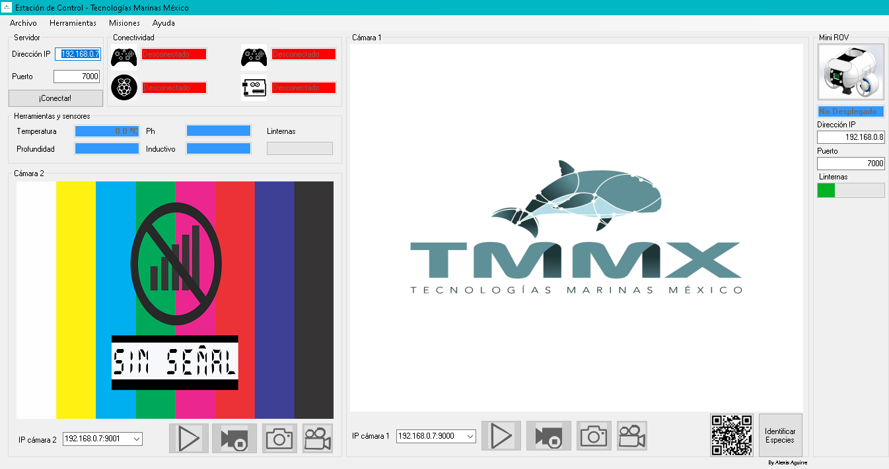

# Estación de control ROV

## Este es el software de la estación de control del mini ROV Nautilus, que desarrollé para la startup Tecnologías Marinas México (TMMx), de la que soy parte. Este proyecto surgió con la idea de participar en la competencia internacional MATE Robotics Competition 2018. "ROV" viene de las siglas en inglés de  Remote Operated Vehicle (Vehículo de Operación Remota)
 

____

 

## El presente software permite al operador del ROV:
- ### Pilotarlo. Mediante un control de consola (XBOX®) (Pueden utilizarse 2 mandos de consola y compartir el control del vehículo)
- ### Visualizar los datos que proporcionan los sensores que tiene incorporados
- ### Observar el video transmitido desde sus cámaras, además de tomar fotografías y grabar lo que se visualiza (Visualización de 2 cámaras en la ventana principal, más la visualización de 1 cámara extra que puede mostrarse en una ventana independiente)
- ### Encender o apagar las luces LED del vehículo
- ### Comprobar la conectividad entre la estación de control y los mandos o la computadora a bordo del ROV
- ### Debido a que está ideado para las misiones de la competencia antes mencionada, tiene programadas funcionalidades de:
    - ### Detección de especies marinas (Figuras geométricas)
    - ### Medición de objetos bajo el agua
- ### Además, está diseñado para intercalar el control del mini ROV principal con el micro ROV acoplado al mismo, permitiendo elegir cuál de los 2 vehículos controlar (Funcionalidad no implementada)

## Este software es la mitad del sistema del ROV, pues se conecta al programa de control a bordo del vehículo. Dicho programa fue desarrollado por otro coladorador de TMMx. 